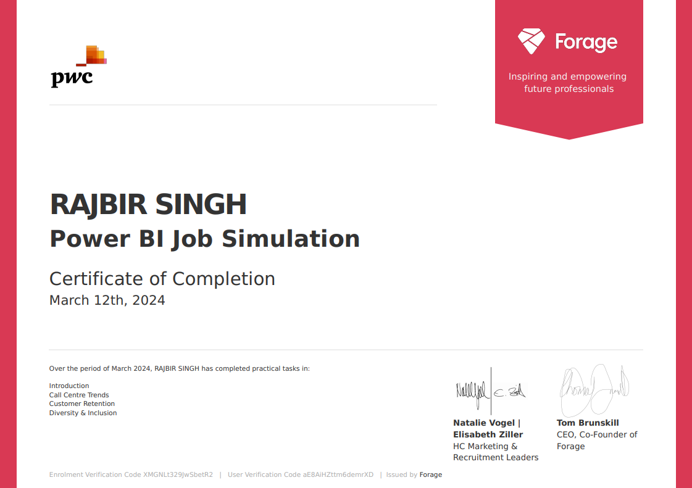

# PwC Switzerland Power BI in Data Analytics Virtual Case Experience

## Certificate

## Task 1: Call Centre Trends
Create a dashboard in Power BI for Claire that reflects all relevant Key Performance Indicators (KPIs) and metrics in the dataset. Get creative! 

**Possible KPIs include (to get you started, but not limited to):**
- Overall customer satisfaction
- Overall calls answered/abandoned
- Calls by time
- Average speed of answer
- Agent’s performance quadrant -> average handle time (talk duration) vs calls answered

## Task 2: Customer Retention
A few weeks after presenting your dashboard to the management, the Retention Manager from the telecom reaches out to you directly. He was impressed by your work and asked if you can put together a dashboard about customer retention.

In addition, to better understand the data, the telecom Retention Manager has scheduled a meeting with the engagement partner at PwC to cover these points:
- Customers in the telecom industry are hard-earned: we don’t want to lose them
- The retention department is here to get customers back in case of termination 
- Currently, we get in touch after they have terminated the contract, but this is reactionary: it would be better to know in advance who is at risk 
- We have done customer analysis with Excel: it has always ended in a dead-end
- We would like to know more about our customers: visualised clearly so that it’s self-explanatory for our management
The Retentions Manager has provided some information, have a look through the resource section.

## Task 3: Diversity & Inclusion
Human Resources at our telecom client is highly into diversity and inclusion. They’ve been working hard to improve gender balance at the executive management level, but they’re not seeing any progress. They’re reaching out to us for help.

At PwC Switzerland we are often approached by clients seeking support with diversity and inclusion. Companies need a workforce of diverse talents and backgrounds to succeed in an increasingly complex and heterogeneous world. To us, diversity and inclusion are business imperatives, not just nice-to-haves. We aim for all of our teams to feel welcome and appreciated. But actually achieving this and unlocking its potential involves a whole set of practical challenges.

Here is a hint: Calculating the following **measures** could help to define proper KPIs:
- number of men
- number of women
- number of leavers
- % employees promoted (FY21)
- % of women promoted
- % of hires men
- % of hires women
- % turnover 
- Average performance rating: men
- Average Performance rating: women

## Reference
 - [Forage - PwC Switzerland Power BI in Data Analytics Virtual Case Experience](https://www.theforage.com/virtual-internships/prototype/a87GpgE6tiku7q3gu/Power%20BI%20in%20Data%20Analytics?ref=zYi2CnpbWjhcS7sAk)
 

